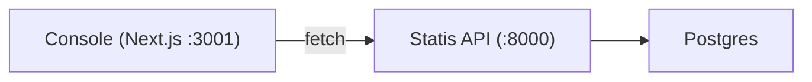

# Milestone 5 -- Console UI (Account Inspector)

## Architecture

A separate Next.js app in `console/` that talks to the FastAPI backend at `http://localhost:8000`. No BFF -- the console calls the Statis API directly from the browser.




## Key Decisions

- **Separate app** at `console/`, not merged into `landing/` (matches [statis_context.md](statis_context.md) line 219)
- **Client-side diff** -- fetch two revisions via `/state/{type}/{id}/at?rev=`, diff in browser with `jsondiffpatch`
- **CORS middleware** must be added to [api/app/main.py](api/app/main.py) to allow console origin
- **One small API addition** -- `GET /deliveries?entity_type=X&entity_id=Y` since the current delivery trace endpoint is subscription-scoped, but the console needs entity-scoped delivery lookup

## Tech Stack (console/)

- Next.js (App Router), React 19, TypeScript
- Tailwind CSS + shadcn/ui (same conventions as `landing/`)
- `jsondiffpatch` for the Diff tab
- Playwright for the smoke test

## UI Layout

The console is a single-page inspector. The user enters `entity_type` (defaulting to `account`) and `entity_id`, then sees four tabs:

### Tab 1 -- State

- Current state JSON (syntax-highlighted)
- Metadata: `state_version`, `state_hash`, `last_event_id`
- Provenance event IDs list
- **API:** `GET /state/{entity_type}/{entity_id}`

### Tab 2 -- Timeline

- Chronological list of events for the entity
- Each row: `event_id`, `event_type`, `occurred_at`, `producer`, expandable `payload`
- **API:** `GET /events?entity_type=X&entity_id=Y`

### Tab 3 -- Diff

- Two revision inputs (`from_rev`, `to_rev`)
- Side-by-side or patch-style JSON diff
- **API:** Two calls to `GET /state/{entity_type}/{entity_id}/at?rev=`
- **Lib:** `jsondiffpatch` for diffing + rendering

### Tab 4 -- Deliveries

- Table of deliveries for this entity across all subscriptions
- Columns: `subscription_id`, `state_version`, `status`, `attempt_count`, `last_error`, `sent_at`
- **API:** `GET /deliveries?entity_type=X&entity_id=Y` (new endpoint)

## API Changes (small)

### 1. CORS middleware in [api/app/main.py](api/app/main.py)

```python
from fastapi.middleware.cors import CORSMiddleware
app.add_middleware(
    CORSMiddleware,
    allow_origins=["http://localhost:3000", "http://localhost:3001"],
    allow_methods=["*"],
    allow_headers=["*"],
)
```

### 2. New delivery query endpoint in [api/app/api/routes/deliveries.py](api/app/api/routes/deliveries.py)

```python
@router.get("/deliveries")
def list_deliveries(entity_type: str, entity_id: str, db=Depends(get_db)):
    rows = db.execute(
        select(Delivery)
        .where(Delivery.entity_type == entity_type, Delivery.entity_id == entity_id)
        .order_by(Delivery.created_at.desc())
    ).scalars().all()
    return rows
```

## Console App Structure

```
console/
  package.json
  next.config.ts
  tsconfig.json
  tailwind.config.ts
  components.json          # shadcn/ui
  playwright.config.ts
  src/
    app/
      layout.tsx           # root layout, global styles
      page.tsx             # Account Inspector (lookup + tabs)
      globals.css
    components/
      entity-lookup.tsx    # entity_type + entity_id form
      tabs/
        state-tab.tsx
        timeline-tab.tsx
        diff-tab.tsx
        deliveries-tab.tsx
    lib/
      api.ts               # fetch helpers for Statis API
      utils.ts             # cn() etc from shadcn
  tests/
    inspector.spec.ts      # Playwright smoke test
```

## Playwright Smoke Test

1. Seed a demo entity via `POST /events` (multiple events to build state)
2. Navigate to `http://localhost:3001`
3. Enter `account` / `demo-acct-1`, click Inspect
4. Assert State tab shows `state_version >= 1` and a non-empty JSON state
5. Switch to Timeline tab, assert events are listed
6. (Optionally) check Diff tab with rev 1 vs current

## Acceptance Criteria

- Can look up any entity by type + ID
- All four tabs render real data from the API
- Playwright smoke test passes
- End-to-end entity debugging in under 2 minutes locally

