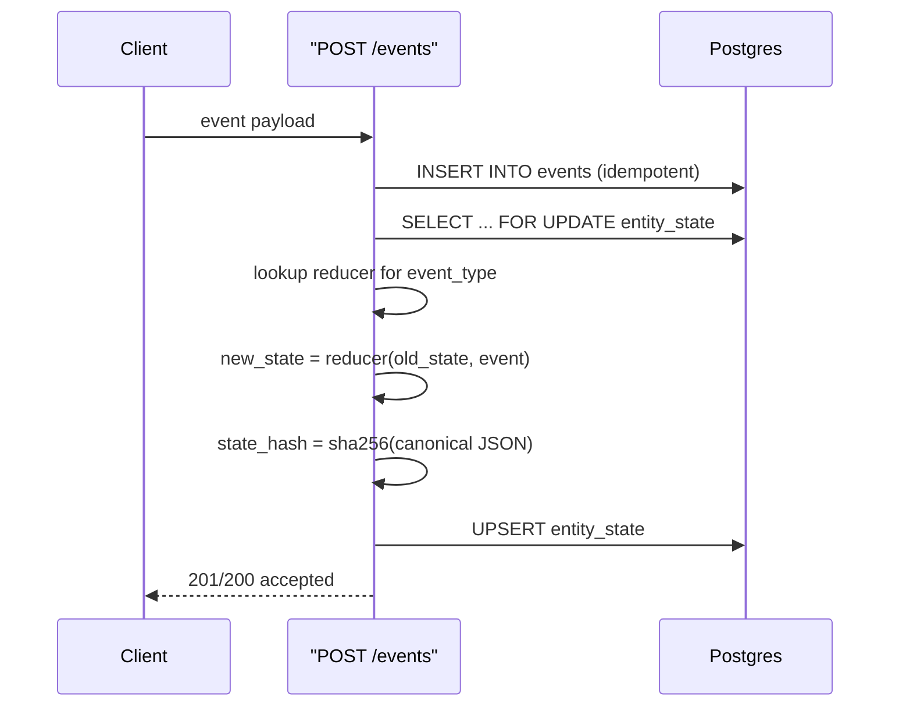

# Milestone 2 — Deterministic Materialized State

## Data flow (materialize-on-write)




## 1. Alembic migration for `entity_state`

New file: `api/alembic/versions/0002_create_entity_state_table.py`

Columns (from STATIS_CONTEXT.md section 5):

- `entity_type` (string, PK part 1)
- `entity_id` (string, PK part 2)
- `state` (JSONB)
- `state_version` (integer, starts at 0, incremented each materialization)
- `last_event_id` (string, FK to events)
- `last_occurred_at` (timestamptz)
- `state_hash` (string, sha256 hex)
- `materialized_at` (timestamptz, server default now())
- `provenance_event_ids` (JSONB array of event_id strings)

Composite PK: `(entity_type, entity_id)`.

## 2. ORM model

New file: `api/app/models/entity_state.py`

Register it in [api/alembic/env.py](api/alembic/env.py) alongside the existing event import so Alembic sees the metadata.

## 3. Reducer framework

New file: `api/app/reducers/registry.py`

- A dict mapping `event_type -> Callable[[dict, Event], dict]`.
- `get_reducer(event_type)` returns the function or raises if unknown.
- Each reducer is a **pure function**: `(current_state: dict, event: Event) -> new_state: dict`. No randomness, no `now()`.

New file: `api/app/reducers/account.py`

Three reducers scoped to the demo:

- `ticket.updated` -- merges `payload` into `state["tickets"][ticket_id]`
- `plan.changed` -- sets `state["plan"]` from payload

These are intentionally minimal; just enough for the CSM demo scenario.

## 4. Canonical hashing utility

New file: `api/app/utils/hashing.py`

```python
import hashlib, json

def canonical_state_hash(state: dict) -> str:
    canonical = json.dumps(state, sort_keys=True, separators=(",", ":"))
    return hashlib.sha256(canonical.encode()).hexdigest()
```

## 5. Materialize-on-write in POST /events

Modify [api/app/repositories/events.py](api/app/repositories/events.py):

After a successful insert (not a duplicate), within the same DB session/transaction:

1. `SELECT ... FOR UPDATE` the `entity_state` row for `(entity_type, entity_id)`.
2. Look up the reducer for `event_type`.
3. Compute `new_state = reducer(old_state or {}, event)`.
4. Compute `state_hash = canonical_state_hash(new_state)`.
5. UPSERT `entity_state` with incremented `state_version`, updated `provenance_event_ids` (append current `event_id`), `last_event_id`, `last_occurred_at`, `materialized_at = now()`.
6. Commit.

If the event is a duplicate (idempotent path), skip materialization entirely.

## 6. GET /state/{entity_type}/{entity_id}

New file: `api/app/api/routes/state.py`

New schema: `api/app/schemas/state.py`

Response shape (from STATIS_CONTEXT.md section 7):

```json
{
  "entity_type": "account",
  "entity_id": "acc_1",
  "state": { ... },
  "state_version": 3,
  "state_hash": "a1b2c3...",
  "last_event_id": "evt_3",
  "provenance": ["evt_1", "evt_2", "evt_3"]
}
```

Returns 404 if no materialized state exists for that entity.

Wire the new router in [api/app/main.py](api/app/main.py).

## 7. Tests

**Unit tests** (`api/tests/unit/`):

- `test_reducers.py` -- each reducer in isolation: apply event to empty state, apply to existing state, verify output is deterministic and pure.
- `test_hashing.py` -- canonical_state_hash produces stable output regardless of key insertion order.

**Integration tests** (`api/tests/integration/`):

- `test_materialization.py`:
  - **Determinism**: Insert the same sequence of events twice (into two different entity_ids). Assert both produce identical `state_hash`.
  - **Ordering**: Insert events with varying `occurred_at`; verify state reflects the correct deterministic ordering `(occurred_at, ingested_at, event_id)`.
  - **Provenance**: After N events, `GET /state` returns `provenance` containing all N `event_id`s.
  - **Idempotency safety**: Duplicate event does not change `state_version` or `state_hash`.

## 8. Documentation

New file: `docs/architecture.md`

Document:

- Reducer contract (pure function, no side effects)
- Registered event types and what they do
- Canonical JSON hashing rule
- Materialize-on-write flow
- Concurrency model (SELECT FOR UPDATE)

## Files changed / created summary

- **New**: `api/alembic/versions/0002_create_entity_state_table.py`
- **New**: `api/app/models/entity_state.py`
- **New**: `api/app/reducers/registry.py`, `api/app/reducers/account.py`
- **New**: `api/app/utils/hashing.py`
- **New**: `api/app/api/routes/state.py`, `api/app/schemas/state.py`
- **New**: `api/tests/unit/test_reducers.py`, `api/tests/unit/test_hashing.py`
- **New**: `api/tests/integration/test_materialization.py`
- **New**: `docs/architecture.md`
- **Modified**: `api/app/repositories/events.py` (add materialize-on-write)
- **Modified**: `api/app/main.py` (register state router)
- **Modified**: `api/alembic/env.py` (import entity_state model)

