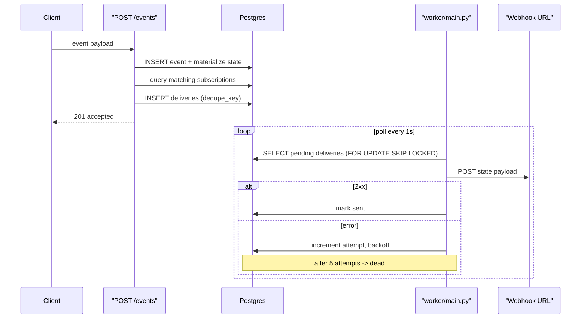

# Milestone 3 — Subscriptions + Delivery Queue + Worker

## Architecture overview




## 1. Alembic migrations (0003 + 0004)

### `subscriptions` table

File: `api/alembic/versions/0003_create_subscriptions_table.py`

- `subscription_id` (string PK, server-generated UUID)
- `entity_type` (string, required) -- filter dimension
- `event_types` (JSONB array, nullable) -- optional filter; if null matches all event types
- `destination` (string, webhook URL)
- `status` (string: `active` / `paused`, default `active`)
- `created_at` (timestamptz, server default now())

### `deliveries` table

File: `api/alembic/versions/0004_create_deliveries_table.py`

- `delivery_id` (string PK, server-generated UUID)
- `subscription_id` (string FK -> subscriptions)
- `entity_type` (string)
- `entity_id` (string)
- `state_version` (integer -- the rev being delivered)
- `dedupe_key` (string, unique) -- `{subscription_id}:{entity_type}:{entity_id}:{state_version}`
- `status` (string: `pending` / `sent` / `failed` / `dead`, default `pending`)
- `attempt_count` (integer, default 0)
- `next_attempt_at` (timestamptz, server default now())
- `last_error` (text, nullable)
- `sent_at` (timestamptz, nullable)
- `response_code` (integer, nullable)
- `created_at` (timestamptz, server default now())

Index on `(status, next_attempt_at)` for efficient worker polling.

## 2. ORM models

- `api/app/models/subscription.py` -- Subscription model
- `api/app/models/delivery.py` -- Delivery model
- Register both in `api/alembic/env.py`

## 3. Enqueue deliveries on state change

Modify [api/app/repositories/events.py](api/app/repositories/events.py):

After `_materialize()` succeeds and `state_version` has been incremented, call a new `_enqueue_deliveries(db, entity_state_row)` function that:

1. Queries active subscriptions matching `entity_type` (and optionally `event_types`).
2. For each match, inserts a `Delivery` row with `dedupe_key = f"{sub.subscription_id}:{entity_type}:{entity_id}:{state_version}"`.
3. Uses `INSERT ... ON CONFLICT (dedupe_key) DO NOTHING` to prevent duplicate deliveries.

This happens in the same transaction as the event + state commit.

## 4. Subscription API endpoints

File: `api/app/api/routes/subscriptions.py`

Schemas: `api/app/schemas/subscriptions.py`

Endpoints:

- `POST /subscriptions` -- create subscription, returns subscription_id
- `GET /subscriptions` -- list all
- `GET /subscriptions/{id}` -- get one (404 if missing)
- `POST /subscriptions/{id}/pause` -- set status to paused
- `POST /subscriptions/{id}/resume` -- set status to active

Wire into [api/app/main.py](api/app/main.py).

## 5. Delivery trace endpoint

File: `api/app/api/routes/deliveries.py`

Schema: `api/app/schemas/deliveries.py`

- `GET /delivery-trace/{subscription_id}?limit=20` -- returns list of deliveries (newest first) with attempt_count, status, last_error, sent_at, response_code

Wire into main.py.

## 6. Delivery worker

New directory: `worker/`

- `worker/main.py` -- entry point, poll loop
- `worker/deliver.py` -- fetch pending deliveries, POST webhook, update status

Worker logic:

1. Poll every 1 second: `SELECT ... FROM deliveries WHERE status IN ('pending','failed') AND next_attempt_at <= now() ORDER BY next_attempt_at LIMIT 10 FOR UPDATE SKIP LOCKED`
2. For each delivery: load the entity_state, POST JSON to `subscription.destination`
3. On 2xx: set `status='sent'`, `sent_at=now()`, `response_code`
4. On error: increment `attempt_count`, compute `next_attempt_at` with exponential backoff (`2^attempt * base_delay`), set `last_error`
5. After 5 attempts: set `status='dead'` (DLQ)

The worker imports models from `api/app/` via `sys.path` manipulation or a shared package. Uses its own `DATABASE_URL` env var and SQLAlchemy session.

Webhook payload shape:

```json
{
  "subscription_id": "...",
  "entity_type": "account",
  "entity_id": "acc_1",
  "state_version": 5,
  "state": { ... },
  "state_hash": "abc...",
  "delivered_at": "2026-02-20T..."
}
```

## 7. Subscription templates

New directory: `examples/subscription_templates/`

Three JSON files documenting starter subscription configurations:

- `sales_pause.json` -- entity_type: account, description of when to fire
- `billing_pause_dunning.json` -- entity_type: account
- `csm_escalate.json` -- entity_type: account

Plus a `README.md` explaining these are example configs to POST to `/subscriptions`. Predicates noted as TODO for a future iteration.

## 8. Tests

### Unit tests (`api/tests/unit/`)

- `test_enqueue_deliveries.py` -- test `_enqueue_deliveries` logic with mocked DB: correct subscriptions matched, dedupe_key format, duplicate insert ignored

### Integration tests (`api/tests/integration/`)

- `test_subscriptions_api.py` -- CRUD for subscriptions: create, list, get, pause, resume
- `test_delivery_flow.py`:
  - Create subscription, post events, verify deliveries are enqueued with correct dedupe_keys
  - Verify delivery trace endpoint returns entries
- `test_worker.py`:
  - Spin up a tiny HTTP server as webhook receiver
  - Post events, run one worker poll cycle
  - Assert webhook received correct payload and delivery marked `sent`
  - Retry test: receiver returns 500 twice then 200; verify `attempt_count=3` and final `status=sent`
  - DLQ test: receiver always returns 500; after 5 attempts delivery is `dead`

### Delivery trace test

- After deliveries are sent, `GET /delivery-trace/{subscription_id}` returns entries with correct statuses and attempt counts

## 9. Documentation

Update `docs/architecture.md` with:

- Subscription model and filter semantics
- Delivery queue lifecycle (pending -> sent / failed -> dead)
- Worker polling and retry strategy
- Dedupe mechanism

## Files summary

**New files:**

- `api/alembic/versions/0003_create_subscriptions_table.py`
- `api/alembic/versions/0004_create_deliveries_table.py`
- `api/app/models/subscription.py`
- `api/app/models/delivery.py`
- `api/app/schemas/subscriptions.py`
- `api/app/schemas/deliveries.py`
- `api/app/api/routes/subscriptions.py`
- `api/app/api/routes/deliveries.py`
- `worker/main.py`
- `worker/deliver.py`
- `examples/subscription_templates/` (3 JSON + README)
- `api/tests/unit/test_enqueue_deliveries.py`
- `api/tests/integration/test_subscriptions_api.py`
- `api/tests/integration/test_delivery_flow.py`
- `api/tests/integration/test_worker.py`

**Modified files:**

- `api/app/repositories/events.py` (add `_enqueue_deliveries`)
- `api/app/main.py` (register subscription + delivery-trace routers)
- `api/alembic/env.py` (import subscription + delivery models)
- `docs/architecture.md` (add subscription/delivery docs)

