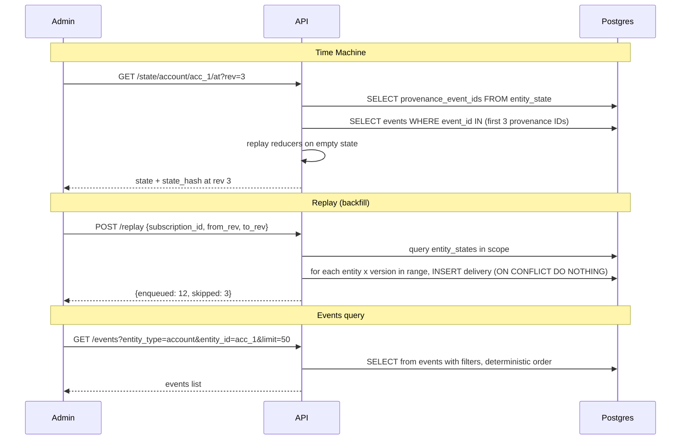

# Milestone 4 — Replay + Time Machine (Admin)

**Goal:** backfill + audit: "what did X know at rev N?"

## Architecture overview




## 1. GET /events — query endpoint

Currently there is no `GET /events` endpoint. Add one to [api/app/api/routes/events.py](api/app/api/routes/events.py).

- **Query params:** `entity_type` (optional), `entity_id` (optional), `since` (optional datetime), `until` (optional datetime), `limit` (default 50, max 200)
- **Order:** deterministic `(occurred_at ASC, ingested_at ASC, event_id ASC)` — matches the existing `ix_events_ordering` index
- **Schema:** new `EventOut` model in [api/app/schemas/events.py](api/app/schemas/events.py)

## 2. GET /state/{entity_type}/{entity_id}/at?rev= — time machine

Add to [api/app/api/routes/state.py](api/app/api/routes/state.py).

**Strategy:** Replay from scratch up to the requested revision using the existing `provenance_event_ids` list stored in `entity_state`.

1. Load the current `entity_state` row to get `provenance_event_ids`
2. Validate `rev` is in range `[1, state_version]`
3. Slice: `event_ids = provenance_event_ids[:rev]`
4. Fetch those events from the `events` table in deterministic order
5. Replay through reducers starting from `{}`: `state = reducer(state, event)` for each
6. Compute `canonical_state_hash(state)`
7. Return `{ entity_type, entity_id, state, state_version: rev, state_hash, provenance: event_ids }`

This is a **pure read-only recomputation** — no rows are written. The existing `provenance_event_ids` array is the source of truth for which events contributed to which revision.

Extract the replay-from-events logic into a reusable function in a new [api/app/repositories/state_replay.py](api/app/repositories/state_replay.py) since it's also needed by the rebuild test.

## 3. POST /replay — delivery backfill

New file: [api/app/api/routes/replay.py](api/app/api/routes/replay.py)

**Request body (schema in [api/app/schemas/replay.py](api/app/schemas/replay.py)):**

```python
class ReplayRequest(BaseModel):
    subscription_id: str            # required
    entity_type: Optional[str]      # optional filter
    entity_id: Optional[str]        # optional filter
    from_rev: Optional[int] = 1     # defaults to 1
    to_rev: Optional[int] = None    # defaults to current state_version
```

**Logic:**

1. Validate subscription exists and is `active` (404/409 otherwise)
2. Query `entity_state` rows matching `entity_type` (and `entity_id` if provided)
3. For each entity_state, clamp `from_rev`/`to_rev` to `[1, state_version]`
4. For each version in `[from_rev, to_rev]`, insert a delivery with the standard dedupe_key format: `{subscription_id}:{entity_type}:{entity_id}:{version}`
5. Use `INSERT ... ON CONFLICT (dedupe_key) DO NOTHING` — already-delivered versions are silently skipped
6. Return `{ enqueued: N, skipped: M }` count summary

**Response schema:**

```python
class ReplayResult(BaseModel):
    enqueued: int
    skipped: int
```

The worker will deliver the **current** entity state for these backfill deliveries (same as normal delivery flow). For "what was the state at rev N," the admin uses the time-machine endpoint separately.

## 4. Tests

### Unit tests

- `**api/tests/unit/test_state_replay.py`** — test the `compute_state_at_rev` function:
  - Replaying 3 events produces expected state + hash
  - Replaying N events then N+1 events: the first N revisions are identical
  - Out-of-range rev raises ValueError

### Integration tests

- `**api/tests/integration/test_events_query.py`**:
  - Insert events, query with no filter returns all
  - Filter by `entity_type` and `entity_id`
  - `since`/`until` time range filters
  - Deterministic ordering
  - `limit` respected
- `**api/tests/integration/test_time_machine.py`**:
  - Post 5 events, `GET /state/.../at?rev=3` returns the state as of event 3
  - Rev matches known golden hash (determinism)
  - Rev out of range returns 400 or 422
  - **Rebuild from scratch**: delete `entity_state` row, recompute by replaying all events from the events table, compare `state_hash` at each rev — must match
- `**api/tests/integration/test_replay.py`**:
  - Create subscription, post 5 events, then POST /replay for the subscription
  - Verify deliveries are enqueued for each version in range
  - Verify dedupe: replaying again enqueues 0 new deliveries
  - Verify `from_rev`/`to_rev` scoping
  - Verify subscription not found returns 404

## 5. Docs

Update [docs/architecture.md](docs/architecture.md) with:

- Events query endpoint + filter semantics
- Time-machine endpoint: how state-at-rev is computed via provenance replay
- Replay endpoint: backfill semantics, dedupe behavior, relationship to delivery queue

## Files summary

**New files:**

- `api/app/repositories/state_replay.py` — `compute_state_at_rev(events)` pure function
- `api/app/schemas/replay.py` — `ReplayRequest` + `ReplayResult`
- `api/app/api/routes/replay.py` — `POST /replay`
- `api/tests/unit/test_state_replay.py`
- `api/tests/integration/test_events_query.py`
- `api/tests/integration/test_time_machine.py`
- `api/tests/integration/test_replay.py`

**Modified files:**

- `api/app/schemas/events.py` — add `EventOut` model
- `api/app/api/routes/events.py` — add `GET /events` query endpoint
- `api/app/api/routes/state.py` — add `GET /state/{entity_type}/{entity_id}/at` endpoint
- `api/app/main.py` — register replay router
- `docs/architecture.md` — add replay + time-machine sections

