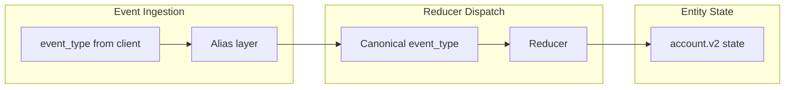

# Milestone 2.5 — Customer Ops "Account State Pack"

## Architecture: aliasing + schema versioning




- **Event log stays immutable**: `event_type` stored as-is (e.g. `ticket.updated`).
- **Alias layer** in the reducer dispatcher normalizes old names to canonical names before routing:
  - `ticket.updated` -> `support.ticket_updated`
  - `plan.changed` -> `billing.plan_changed`
- **Schema version** stored on `entity_state` and returned from `GET /state`. Existing M2 shape is `account.v1`; new opinionated pack is `account.v2`.
- **Migration event** `account.schema_migrated`: a reducer that deterministically transforms v1 -> v2 state. After it, all subsequent events apply to the v2 shape.

## 1. Event-type alias layer

Modify [api/app/reducers/registry.py](api/app/reducers/registry.py):

- Add `_ALIASES: Dict[str, str]` mapping old -> canonical names.
- `get_reducer()` and `has_reducer()` resolve through aliases before lookup.
- Old event types still work transparently; no changes to event storage.

## 2. Account v2 state schema

The opinionated v2 state shape for `entity_type = "account"`:

```python
{
    "schema_version": "account.v2",
    "blockers": [],            # list[str]
    "risk_flags": [],          # list[str]
    "sentiment": None,         # {"label": "positive"|"neutral"|"negative", "updated_at": str} or None
    "open_incidents": [],      # list[{"id", "type", "status", "occurred_at"}]
    "churn_risk": False,       # bool
    "next_actions": [],        # list[{"owner": str, "action": str, "reason": str}]
    "plan": None,              # str or None (carried from billing.plan_changed)
    "extensions": {}           # legacy/extra fields
}
```

Add a helper `init_account_v2() -> dict` and a `upgrade_v1_to_v2(old_state) -> dict` migration function in a new module.

## 3. Rewrite + add reducers

Replace [api/app/reducers/account.py](api/app/reducers/account.py) with reducers that target the v2 schema:

- `**support.ticket_updated**` (alias: `ticket.updated`) -- upserts into `open_incidents`, derives `churn_risk`.
- `**support.incident_reported**` -- appends to `open_incidents`, adds to `blockers` if severity is high.
- `**support.sentiment_updated**` -- sets `sentiment.label` and `sentiment.updated_at` from payload.
- `**billing.plan_changed**` (alias: `plan.changed`) -- sets `plan`, may add `risk_flags` on downgrade.
- `**csm.escalation_requested**` -- appends to `next_actions` with `owner`, `action`, `reason`.
- `**account.schema_migrated**` -- transforms v1 state to v2 deterministically.

Each reducer calls `upgrade_v1_to_v2(state)` if `state.get("schema_version") != "account.v2"` (lazy upgrade-on-write, backed by the explicit migration event for audit).

## 4. Conflict rules

New file: `api/app/reducers/conflict_rules.py`

Document and implement:

- **Source precedence**: system-of-record > human > agent (for fields like `sentiment`, `churn_risk`).
- **Tie-breaking**: existing `(occurred_at, ingested_at, event_id)` ordering is the ultimate tie-breaker.
- Helper `should_apply(existing_field_source, new_event_producer) -> bool` used by reducers that set contested fields.

## 5. Schema version on entity_state

The existing `entity_state` table and model already have all needed columns. The `state` JSONB will carry `schema_version` inside it. No migration needed -- the version lives in the state dict itself.

`GET /state` response already returns the full `state` dict, so consumers see `schema_version` automatically.

## 6. CSM demo script

New file: `examples/csm_demo.py`

A runnable script that:

1. Posts 5-8 events covering each new event type (incident, sentiment, plan change, escalation).
2. Calls `GET /state/account/{id}` after each event and prints the state diff.
3. Shows how stale assumptions fail without state, then uses the state endpoint to correct.

Requires only the API to be running (no subscriptions needed).

## 7. Tests

**Unit tests** -- `api/tests/unit/test_account_pack.py`:

- Each v2 reducer on empty state and existing state.
- Immutability (input not mutated).
- Alias resolution: `ticket.updated` and `support.ticket_updated` route to the same reducer.
- `upgrade_v1_to_v2` produces correct v2 shape from a v1 state.
- Conflict rules: `should_apply` precedence logic.
- Schema validation: bad payloads (missing required keys) raise or are handled gracefully.

**Golden snapshot test** -- `api/tests/unit/test_golden_snapshot.py`:

- A hardcoded event stream -> apply reducers in sequence -> assert final state dict and `state_hash` match a known-good snapshot.

**Integration test** -- `api/tests/integration/test_account_pack.py`:

- Wedge determinism: same event stream on two entities -> identical `state_hash`.
- Full CSM scenario: post events via API, verify final state matches golden snapshot.
- Alias equivalence: posting with old `ticket.updated` vs `support.ticket_updated` produces identical state.

## 8. Documentation

New file: `docs/state_pack_account.md`:

- v2 state schema (field descriptions, types).
- Each reducer: event_type, payload shape, state mutation, examples.
- Conflict rules table (source precedence, tie-breaking).
- Migration path: v1 -> v2 via `account.schema_migrated` or lazy upgrade.
- Alias table (old -> canonical).

## Files summary

- **Modified**: `api/app/reducers/registry.py` (alias layer)
- **Rewritten**: `api/app/reducers/account.py` (v2 reducers)
- **New**: `api/app/reducers/conflict_rules.py`
- **New**: `api/app/reducers/account_schema.py` (init_v2, upgrade_v1_to_v2)
- **New**: `examples/csm_demo.py`
- **New**: `api/tests/unit/test_account_pack.py`
- **New**: `api/tests/unit/test_golden_snapshot.py`
- **New**: `api/tests/integration/test_account_pack.py`
- **New**: `docs/state_pack_account.md`
- **Updated**: `api/tests/unit/test_reducers.py` (update for new function names/imports)

