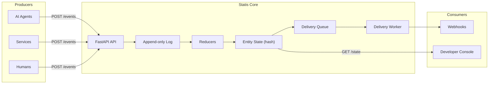

<p align="center">
  <a href="https://statis.dev">
    
  </a>
</p>

<p align="center">
  <a href="https://statis.dev">Website</a>
  &nbsp;&middot;&nbsp;
  <a href="https://docs.statis.dev">Docs</a>
  &nbsp;&middot;&nbsp;
  <a href="https://x.com/statis_ai">Twitter</a>
</p>

<p align="center">
  <a href="https://github.com/statis-ai/statis-core/stargazers"></a>
  &nbsp;
  <a href="https://github.com/statis-ai/statis-core/blob/main/LICENSE"></a>
  &nbsp;
  <a href="https://github.com/statis-ai/statis-core/commits/main"></a>
  &nbsp;
  <a href="https://github.com/statis-ai/statis-core/pulls"></a>
</p>

<p align="center">
  <b>Append-only semantic events &rarr; deterministic materialized state &rarr; push updates + replay for audit.</b>
</p>

---

## Introduction

[Statis](https://statis.dev) is a **Semantic Event Bus** for AI workflows and automations. It ingests claims, facts, and signals from agents, services, and humans into an append-only log, deterministically materializes entity state, pushes state-change notifications to subscribers, and supports full replay and time travel for audit.

This is **not** a memory DB, vector store, RAG system, or agent framework.
This is **PUSH + REPLAY + GOVERNED MATERIALIZED STATE**.

### Core Primitives

| | Primitive | What it does |
|---|---|---|
| **Log** | Append-only Event Log | Idempotent ingestion, deterministic ordering, immutable source of truth |
| **State** | Materialized State | Deterministic reducers, SHA-256 state hash, provenance tracking per revision |
| **Push** | Subscriptions | Webhook delivery with exponential backoff, dead-letter queue, delivery trace |
| **Replay** | Time Travel | "What did X know at rev N?" &mdash; backfill, state-at-revision, full audit trail |

## Architecture



## Quickstart

### 1. Database

Ensure PostgreSQL is running locally and set `DATABASE_URL`:

```bash
cd api
pip install -r requirements.txt
alembic upgrade head
python scripts/seed_admin.py   # generates your first API key
```

### 2. Start services

```bash
# Terminal 1 — API
cd api && fastapi run app/main.py

# Terminal 2 — Console
cd console && npm install && npm run dev

# Terminal 3 — Worker
cd worker && python main.py
```

### 3. Try it out

```bash
# Ingest an event
curl -s -X POST http://localhost:8000/events \
  -H "Content-Type: application/json" \
  -H "X-API-Key: $API_KEY" \
  -d '{
    "event_id": "evt-001",
    "entity_type": "account",
    "entity_id": "acct-42",
    "event_type": "support.incident_reported",
    "payload": {"severity": "high", "issue": "login_outage"},
    "occurred_at": "2025-06-01T10:00:00Z",
    "producer": "zendesk",
    "schema_version": "1"
  }'

# Read the materialized state
curl -s http://localhost:8000/state/account/acct-42 \
  -H "X-API-Key: $API_KEY"

# Time travel — inspect state at a specific revision
curl -s http://localhost:8000/state/account/acct-42/at?rev=1 \
  -H "X-API-Key: $API_KEY"
```

## Use Cases

**Customer Ops Coordination** — Support, CSM, Sales, and Billing share a single golden record per account. When Support reports an outage, Sales auto-pauses outreach and Billing suspends dunning — all within seconds, fully auditable.

**AI Agent Orchestration** — Multiple agents publish facts to a shared entity. Statis materializes a deterministic state that any agent can read, avoiding stale or conflicting views across your agent fleet.

**Compliance and Audit** — Every state transition is derived from an immutable event log with SHA-256 hashing. Replay any point in time: *"What did Sales know when it paused?"*

**Webhook-driven Workflows** — Subscribe to state changes and receive push notifications with delivery guarantees — exponential backoff, dead-letter queue, and a full delivery trace for every attempt.

## Integrations & Demos

| Integration | Status | Link |
|---|---|---|
| **CrewAI + Statis** — Multi-agent workflows where CrewAI agents publish events and subscribe to state changes | Coming soon | [examples/](examples/) |
| **CSM Demo** — End-to-end outage cascade prevention scenario | Available | [Guide](docs/legacy/demo_csm.md) |

## API Surface

| Endpoint | Description |
|---|---|
| `POST /events` | Ingest events (idempotent) |
| `GET /events` | Query event log |
| `GET /state/{entity_type}/{entity_id}` | Read materialized state |
| `GET /state/{entity_type}/{entity_id}/at?rev=` | Time travel to any revision |
| `POST /subscriptions` | Subscribe to state changes |
| `POST /replay` | Replay deliveries for a subscription |
| `GET /delivery-trace/{subscription_id}` | Delivery audit trail |
| `GET /health` | Health check |

## Tech Stack

- **Backend:** Python, FastAPI, SQLAlchemy, Alembic
- **Database:** PostgreSQL
- **Console:** Next.js, React
- **Worker:** Python daemon (DB-backed delivery queue)

## Documentation & Support

- Full docs: [docs.statis.dev](https://docs.statis.dev)
- Website: [statis.dev](https://statis.dev)
- Twitter: [@statis_ai](https://x.com/statis_ai)

## License

MIT — see [LICENSE](LICENSE) for details.
