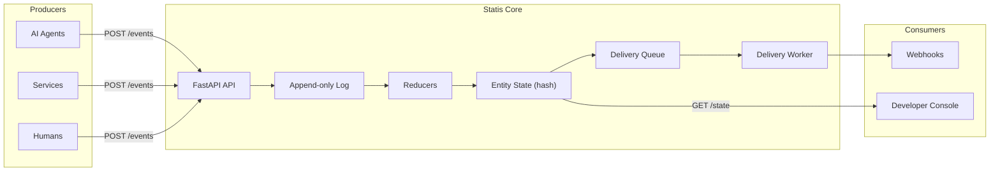

<p align="center">
  <a href="https://statis.dev">
    
  </a>
</p>

<p align="center">
  <a href="https://statis.dev">Website</a>
  &nbsp;&middot;&nbsp;
  <a href="https://docs.statis.dev">Docs</a>
  &nbsp;&middot;&nbsp;
  <a href="https://x.com/statis_ai">Twitter</a>
</p>

<p align="center">
  <a href="https://github.com/statis-ai/statis-core/stargazers"></a>
  &nbsp;
  <a href="https://github.com/statis-ai/statis-core/blob/main/LICENSE"></a>
  &nbsp;
  <a href="https://github.com/statis-ai/statis-core/commits/main"></a>
  &nbsp;
  <a href="https://github.com/statis-ai/statis-core/pulls"></a>
</p>

<h1 align="center">Statis</h1>

<p align="center">
  <b>The Semantic Event Bus for AI Workflows</b><br>
  Append-only semantic events &rarr; deterministic materialized state &rarr; push updates + replay for audit.
</p>

---

## 💡 Why Statis?

When AI agents poll isolated databases or rely on stateless memory, they invent their own reality. This causes "Agent Amnesia," conflicts, and unpredictable behavior. 

[Statis](https://statis.dev) provides a single source of truth for your AI swarm. It ingests claims, facts, and signals from agents into an append-only log, deterministically materializes entity state, and pushes state-change notifications immediately.

*   ⚡ **Single Source of Truth**: Guarantee all agents act on the exact same cryptographic state at the exact same millisecond.
*   🔒 **Audit & Time Travel**: Every state is derived from an immutable SHA-256 hashed event log. Replay history to answer "What did X know at rev N?"
*   🚀 **Push, Don't Poll**: Webhook delivery with exponential backoff and trace ensures agents react to critical events in under 300ms.

---

## 🎯 Use Cases

Statis is built for complex, multi-agent orchestrations and hybrid human-AI workflows:

*   **🤖 AI Agent Orchestration**: Multiple specialized agents (e.g., in a CrewAI swarm) publish facts to a shared entity. Statis materializes a deterministic state that any agent can read, avoiding stale views and race conditions.
*   **🚨 Customer Ops Coordination**: Support, CSM, Sales, and Billing share a single golden record. When a Support agent reports an outage, Sales automatically pauses outreach and Billing suspends dunning.
*   **⚖️ Compliance & Governance**: Shadow auditing for high-risk AI decisions. Replay the exact state context an agent had when making a decision to prove compliance.
*   **⚡ Webhook-driven Pipelines**: Ditch cron jobs. Ingest raw events, reduce them into a golden state record, and automatically kick off downstream AI multi-agent workflows via push notifications.

---

## 💻 Integrations

### CrewAI + Statis

Prevent "Agent Amnesia" in CrewAI. Equip your agents with Statis tools to publish semantic events and seamlessly share materialized state across isolated runs.

```python
import os
from crewai import Agent, Task, Crew
from statis_tools import make_push_tool, make_read_tool

os.environ["OPENAI_API_KEY"] = "sk-..."
STATIS_API_KEY = "st_admin_..." # Your Statis API Key

# 1. Equip agents with Statis Tools
push_tool = make_push_tool(api_key=STATIS_API_KEY)
read_tool = make_read_tool(api_key=STATIS_API_KEY)

# 2. Support Agent publishes an outage fact
support_agent = Agent(
    role="Support Specialist",
    goal="Identify and report system outages",
    backstory="You monitor systems and report directly to the Statis event bus.",
    tools=[push_tool],
    verbose=True
)

# 3. Sales Agent reads the golden state
sales_agent = Agent(
    role="Sales Representative",
    goal="Read the latest account state before outreach",
    backstory="You always check the Statis state for 'outage' before emailing customers.",
    tools=[read_tool],
    verbose=True
)

# 4. Create Tasks
task_report = Task(
    description="Publish an event that acct-42 is experiencing an outage.",
    expected_output="Confirmation of published event",
    agent=support_agent
)

task_check = Task(
    description="Read state for acct-42 and decide if we should send a marketing email.",
    expected_output="Decision: Send or Pause outreach",
    agent=sales_agent
)

# 5. Run the Crew
crew = Crew(
    agents=[support_agent, sales_agent],
    tasks=[task_report, task_check]
)
crew.kickoff()
```
*See the full codebase in `examples/crewai/` for advanced RBAC and Time Travel demonstrations.*

---

## 🚀 Quickstart

Ensure PostgreSQL is running locally.

### 1. Installation

```bash
git clone https://github.com/statis-ai/statis-core.git
cd statis-core/api

pip install -r requirements.txt
alembic upgrade head
python scripts/seed_admin.py   # Generates your STATIS_API_KEY
```

### 2. Start Services

```bash
# Terminal 1 — Statis API
cd api && fastapi run app/main.py

# Terminal 2 — Statis Console
cd console && npm install && npm run dev

# Terminal 3 — Delivery Worker
cd worker && python main.py
```

### 3. Try it out

**Ingest an event:**
```bash
curl -s -X POST http://localhost:8000/events \
  -H "Content-Type: application/json" \
  -H "X-API-Key: $API_KEY" \
  -d '{
    "event_id": "evt-001",
    "entity_type": "account",
    "entity_id": "acct-42",
    "event_type": "support.incident_reported",
    "payload": {"severity": "high", "issue": "login_outage"},
    "occurred_at": "2025-06-01T10:00:00Z",
    "producer": "support_agent",
    "schema_version": "1"
  }'
```

**Read materialized state:**
```bash
curl -s http://localhost:8000/state/account/acct-42 \
  -H "X-API-Key: $API_KEY"
```

**Time travel to a specific revision:**
```bash
curl -s http://localhost:8000/state/account/acct-42/at?rev=1 \
  -H "X-API-Key: $API_KEY"
```

---

## 🏗️ Architecture



## 📚 API Surface

| Endpoint | Description |
|---|---|
| `POST /events` | Ingest events (idempotent) |
| `GET /events` | Query event log |
| `GET /state/{entity_type}/{entity_id}` | Read materialized state |
| `GET /state/{entity_type}/{entity_id}/at?rev=` | Time travel to any revision |
| `POST /subscriptions` | Subscribe to state changes |
| `POST /replay` | Replay deliveries for a subscription |

## 🛠 Tech Stack

- **Backend:** Python, FastAPI, SQLAlchemy, Alembic
- **Database:** PostgreSQL
- **Console:** Next.js, React
- **Worker:** Python daemon (DB-backed delivery queue)

## 📖 Documentation & Support

- **Full Docs:** [docs.statis.dev](https://docs.statis.dev)
- **Website:** [statis.dev](https://statis.dev)
- **Twitter:** [@statis_ai](https://x.com/statis_ai)

---

## 📝 License

MIT — see [LICENSE](LICENSE) for details.
